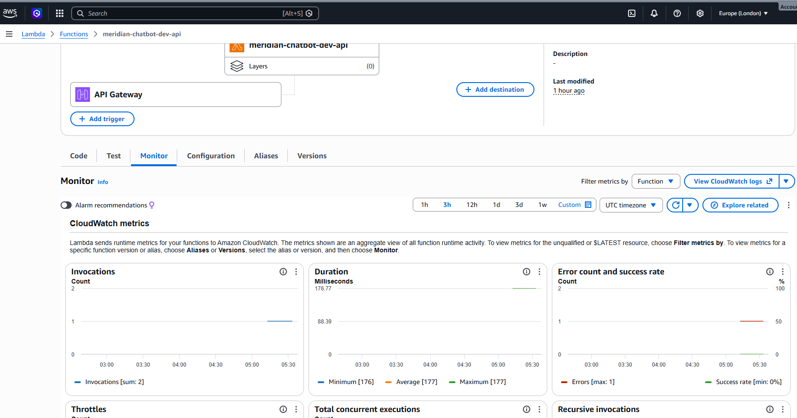

# Meridian ChatBot

Meridian ChatBot is a **tool-augmented AI assistant** designed for Meridian Electronics to automate customer support operations such as:

* Product availability lookup
* Order placement
* Order history retrieval
* Authenticated customer interactions

The system is built with a **secure, MCP-driven architecture**, ensuring that the AI never directly accesses internal databases or services.

---

# 🚀 Overview

Traditional support systems rely heavily on human agents. Meridian ChatBot introduces an **AI Orchestrator layer** that uses an LLM to intelligently decide when to:

* Respond directly
* Call backend tools via an MCP server

All backend interactions are strictly routed through the MCP layer, enforcing **security, observability, and control**.

---

# 🧠 Core Concept

> The AI does not access business systems directly.
> It uses **tools exposed via an MCP server**.

---

# 🏗️ Architecture

## High-Level Architecture

```
[ Client (Browser / Next.js UI) ]
                |
                v
[ API Gateway Layer (FastAPI) ]
                |
                v
[ AI Orchestrator Service ]
   (LLM + Tool Routing + Streaming)
                |
                v
[ MCP Server (Tool Execution Layer) ]
                |
                v
[ Internal Services ]
 (Orders, Products, Users)
```

---

## 🔹 Components

### 1. Frontend (Next.js)

* Chat interface (streaming responses)
* User authentication via Clerk
* Sends authenticated requests to backend

---

### 2. API Gateway (FastAPI)

Acts as:

* Entry point for all requests
* Rate limiter
* Logging boundary
* Streaming handler (SSE)

Key responsibilities:

* Validate request
* Attach user context
* Forward to orchestrator

---

### 3. AI Orchestrator (Core Brain)

Located in:

```
app/orchestrator.py
```

Responsibilities:

* Interact with LLM
* Decide when to call tools
* Execute tools via MCP
* Stream responses back to client

Key features:

* Tool-aware reasoning
* Multi-step execution
* Streaming responses (SSE)
* Safe tool argument handling

---

### 4. MCP Tool Client

Located in:

```
app/mcp_client.py
```

Responsibilities:

* Discover available tools
* Execute tools via MCP server
* Inject user context into requests

Key features:

* Tool caching with TTL
* Timeout + retry handling
* Per-user request headers

---

### 5. MCP Server (External)

```
https://order-mcp-74afyau24q-uc.a.run.app/mcp
```

Acts as:

* Tool registry
* Execution layer for backend services

Examples of tools:

* `getProductAvailability`
* `createOrder`
* `getOrderHistory`

---

### 6. Internal Services

* Order Service
* Product Service
* User Service

These are **NOT directly accessible** by the AI.

---

# 🔐 Security Model

* No direct database access from AI
* All operations go through MCP tools
* User identity passed via headers:

  * `x-user-id`
  * `x-user-email`
  * `x-org-id`
* JWT handled upstream (e.g., Clerk)

---

# 🔄 Service-to-Service Flow

## Example: "Show my last 3 orders"

### Step 1: User Request

```
User → Next.js UI → POST /api/chat
```

---

### Step 2: API Gateway

* Applies rate limiting
* Extracts user context
* Forwards request

---

### Step 3: AI Orchestrator

* Builds prompt with:

  * User query
  * Available tools
  * User context

---

### Step 4: LLM Decision

LLM decides:

```
Call tool: getOrderHistory
```

---

### Step 5: MCP Execution

```
AI Orchestrator → MCP Client → MCP Server → Order Service
```

---

### Step 6: Tool Response

```
Order Service → MCP → AI Orchestrator
```

---

### Step 7: Final Response

LLM formats:

```
"Here are your last 3 orders..."
```

---

### Step 8: Streaming to Client

```
AI → SSE → Frontend (real-time updates)
```

---

# 🔁 Streaming Architecture

* Uses **Server-Sent Events (SSE)**

---

# ⚙️ Configuration

Defined in:

```
app/config.py
```

### Key Variables

| Variable                    | Description                  |
| --------------------------- | ---------------------------- |
| `OPENAI_API_KEY`            | LLM API key                  |
| `OPENAI_MODEL`              | Model (default: gpt-4o-mini) |
| `MCP_SERVER_URL`            | MCP endpoint                 |
| `MCP_TOOL_CACHE_SECONDS`    | Tool cache TTL               |
| `RATE_LIMIT_REQUESTS`       | Max requests                 |
| `RATE_LIMIT_WINDOW_SECONDS` | Rate window                  |

---

# 🧪 Running the Application

## 1. Install dependencies

```
uv sync
```

---

## 2. Set environment variables

```
OPENAI_API_KEY=your_key
MCP_SERVER_URL=url here
```

---

## 3. Run server

```
uv run app.run.py 
```

---

## 4. Test endpoints

### Health

```
GET /health
```

### Chat (Streaming)

```
POST /api/chat
```

---

# 📁 Project Structure

```
app/
 ├── main.py              # API Gateway
 ├── orchestrator.py      # AI brain
 ├── mcp_client.py        # MCP integration
 ├── rate_limit.py        # Rate limiting
 ├── schemas.py           # Data models
 ├── config.py            # Settings
 └── logging_config.py    # Logging
```

---


# 🚀 Future Improvements

* Redis-based distributed rate limiting
* Circuit breaker for MCP failures
* Real Time User feedback metric

---


### Why Streaming?

* Improves perceived latency
* Enhances user experience

---

### Why AI Orchestrator Layer?

* Centralized control over:

  * Tool usage
  * Security
  * Observability

---

# Observability

Request flow and where logs land in AWS (structured JSON on Lambda stdout → CloudWatch Logs):



---
# Video
Link: https://drive.google.com/file/d/13ewurxbRoykcnqymevRN5v46XF2mCYwK/edit
---
# 🧠 Summary

Meridian ChatBot is a **secure, scalable AI agent system** that:

* Uses LLMs for reasoning
* Uses MCP for execution
* Maintains strict architectural boundaries
* Streams responses for real-time UX

---


